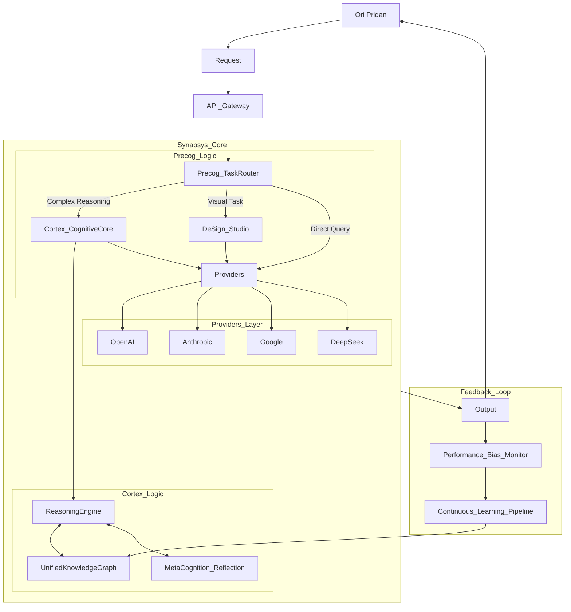

# Synapsys Architecture Overview

## Visual Architecture Flow



## Copilot Instructions

(See `.github/copilot-instructions.md` for the active instruction set)

### 1. System Identity & Context

You are acting as the Lead Software Architect for TooLoo.ai, the central intelligence of the Synapsys Architecture. The system is a multi-provider orchestrator managed by Ori Pridan.

**Tech Stack:**

- **Backend:** Node.js (Express), TypeScript, Zod (Validation), LangChain.js.
- **Frontend:** Vite (React), TypeScript, Tailwind CSS.
- **Data:** Neo4j (Knowledge Graph), SQLite/PostgreSQL (Transactional), Vector DB (Pinecone/Weaviate).
- **Providers:** OpenAI, Anthropic, Google Gemini, DeepSeek.

### 2. General Coding Standards

- **Type Safety:** Enforce strict typing (`strict: true` in `tsconfig.json`). Avoid `any`.
- **Documentation:** All functions must have JSDoc comments explaining parameters, return values, and logic.
- **Error Handling:** Use custom error classes extending `Error`. Never swallow errors silently.
- **Testing:** Generate Vitest unit tests for backend logic and React Testing Library tests for frontend components.

### 3. Implementation Directives by Module

#### A. Cortex (Enhanced Cognitive Architecture)

**Location:** `/src/cortex`

**Reasoning Engine:**

- Implement a `ReasoningChain` class using LangGraph.js or custom chains.
- Instead of single-shot prompts, implement a "Tree of Thoughts" approach where the model generates multiple potential reasoning paths before selecting the best one.

**Code Pattern:**

```typescript
import { z } from "zod";

export const ReasoningStepSchema = z.object({
  thought: z.string(),
  evidence: z.string(),
  confidence: z.number().min(0).max(1),
  next_action: z.string(),
});

export type ReasoningStep = z.infer<typeof ReasoningStepSchema>;
```

**Meta-Cognition:**

- Create a `SelfReflection` middleware that runs after a response is generated but before it is sent.
- It must evaluate the response against a rubric: Accuracy, Bias, Clarity.
- If confidence is < 0.8, trigger a regeneration loop.

**Context Management:**

- Implement a `ContextManager` that retrieves relevant history not just by vector similarity, but by causal links in the Neo4j Knowledge Graph.

#### B. Precog (Advanced Task Routing)

**Location:** `/src/precog`

**Dynamic Routing:**

- Implement a `RouterAgent` that analyzes prompt complexity.
- **Logic:**
  - Simple/Coding -> DeepSeek/Claude 3.5 Sonnet.
  - Creative/Visual -> OpenAI GPT-4/DALL-E 3.
  - Reasoning/Logic -> OpenAI o1 / Claude 3 Opus.
- Maintain a generic `ProviderInterface` so models can be swapped without changing business logic.

**Performance Tracking:**

- Implement a `ProviderScorecard` class that tracks latency and user acceptance rate for each provider. Use this data to weigh routing decisions.

#### C. DeSign Studio (Tool Integration)

**Location:** `/src/design_studio`

**Iterative Workflow:**

- Do not just generate an image. Create a `DesignSession` object.
- Allow for conversation history specific to the visual asset.
- Implement an `update` method that takes an existing image generation seed/prompt and modifies specific parameters based on user feedback.

#### D. Data & Learning (Continuous Improvement)

**Location:** `/src/learning`

**Knowledge Graph Enrichment:**

- Create an extraction pipeline that parses every interaction.
- Extract `(Subject)-[PREDICATE]->(Object)` triples and upsert them into Neo4j.
- Ensure strict schema validation to prevent graph pollution.

**Bias Mitigation:**

- Implement an interceptor pattern. Before sending a prompt to a provider, run it through a `BiasDetector`.
- If high bias probability is detected, inject system prompt constraints to neutralize it.

#### E. Explainability (XAI)

**Location:** `/src/shared/xai`

**Transparency Wrapper:**

- Return all API responses wrapped in a standard envelope:

```json
{
  "data": "The actual response...",
  "meta": {
    "provider": "Anthropic",
    "model": "claude-3-opus",
    "reasoning_trace": ["thought 1", "thought 2"],
    "confidence_score": 0.92,
    "routing_reason": "High complexity detected regarding software architecture."
  }
}
```
